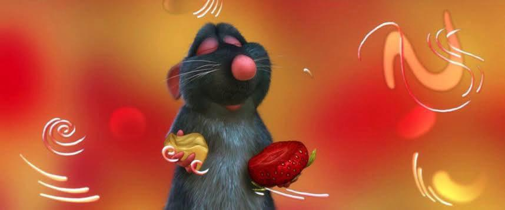
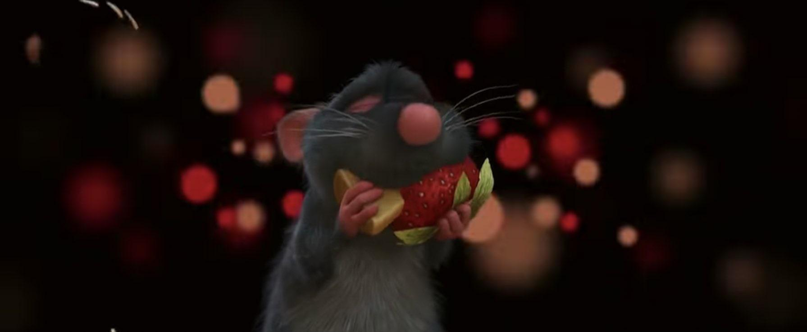
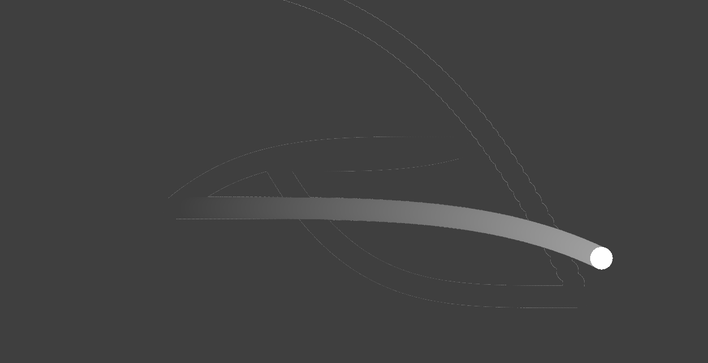

# bxue0412_9103_tut8
This is my Creative Coding Week 8 quiz response.

## Part 1: Imaging Technique Inspiration

This inspiration is a scene from the 2007 film *Ratatouille*. In this scene, the characters eat a piece of cheese and strawberry. The audio and abstract animation visualise how they feel while eating the food. 

[Here is a link to the scene.](https://www.youtube.com/watch?v=rLXYILcRoPQ)

The technique that I find inspiring is **the way that the shapes change in response to the audio.** The animator used a combination of circles, curves, lines, and other shapes to show the character’s mood. This will be helpful to my assignment because it demonstrates how shapes, colour, and audio can be combined to create an engaging and beautiful animation. 

Some screenshots of the scene:

Concept art by animator Michel Gagné. 
He posted his process of creating the scene [here](https://www.gagneint.com/Final%20site/Animation/Pixar/Ratatouille.htm).

## Part 1: Coding Technique Exploration
The technique of moving an object along a curve can be used to implement the imaging technique. This technique will make a shape, such as a circle, move along a certain path. In the video, the shapes appeared and moved in a seemingly random way. This coding technique will make any shape move in response to certain stimuli, such as a button being pressed. 

This technique was found in the p5js.org examples website. In this example, a circle is moved in response to a mouse being pressed. 

[Link to p5.js example with code.](https://p5js.org/examples/motion-moving-on-curves.html)

Screenshot of the object moving example found on the website.

